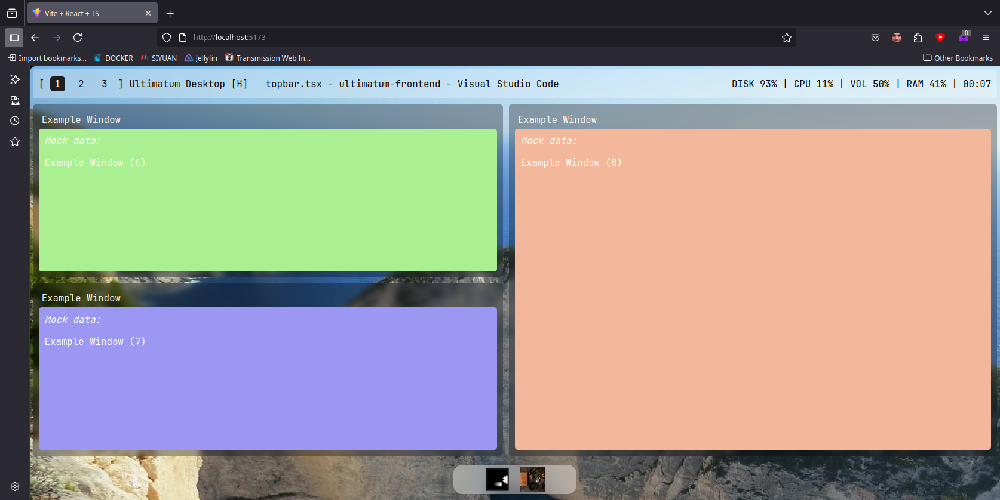

# UM Default-DE

Essentially a mock desktop environment so we can see what stuff should look like in final.   
"Supports" (with stubs and mock data):
- Status bar (vol/disk/cpu/ram/win title/time/workspaces)
- Workspaces
- Window management
- Basic launcher
- TBD (to be done) - Notification "daemon" (notifications sent over IPC)

